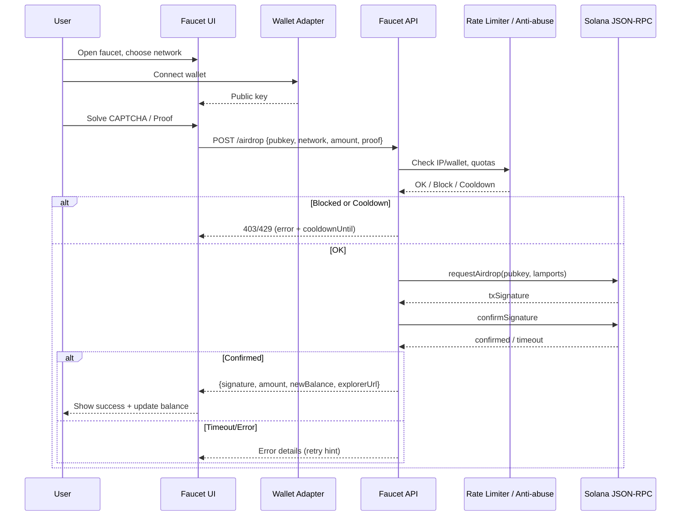

```mermaid
sequenceDiagram
    participant U as User
    participant UI as Faucet UI
    participant WA as Wallet Adapter
    participant API as Faucet API
    participant RL as Rate Limiter / Anti-abuse
    participant RPC as Solana JSON-RPC

    U->>UI: Open faucet, choose network
    U->>WA: Connect wallet
    WA-->>UI: Public key

    U->>UI: Solve CAPTCHA / Proof
    UI->>API: POST /airdrop {pubkey, network, amount, proof}
    API->>RL: Check IP/wallet, quotas
    RL-->>API: OK / Block / Cooldown

    alt Blocked or Cooldown
        API-->>UI: 403/429 (error + cooldownUntil)
    else OK
        API->>RPC: requestAirdrop(pubkey, lamports)
        RPC-->>API: txSignature
        API->>RPC: confirmSignature
        RPC-->>API: confirmed / timeout
        alt Confirmed
            API-->>UI: {signature, amount, newBalance, explorerUrl}
            UI-->>U: Show success + update balance
        else Timeout/Error
            API-->>UI: Error details (retry hint)
        end
    end

```
